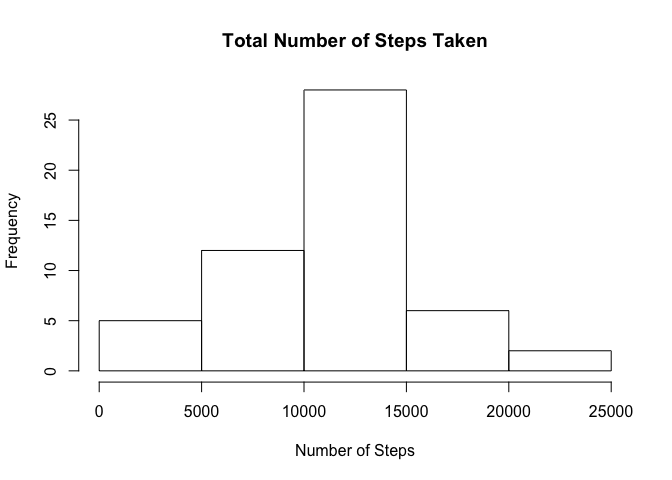
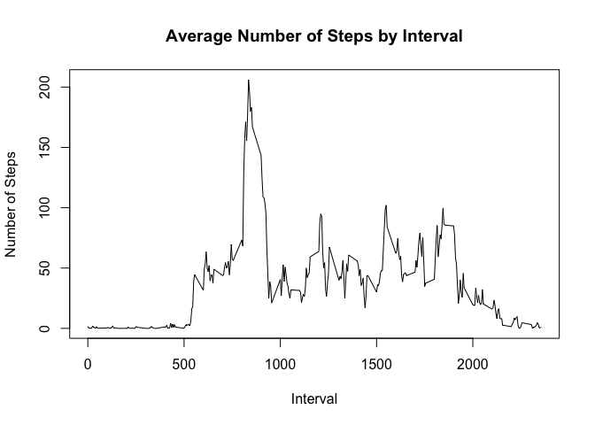
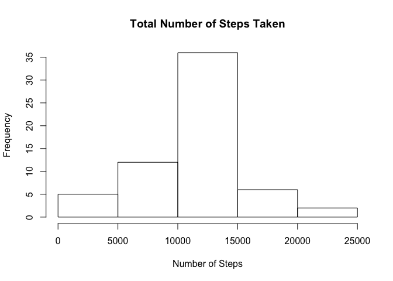
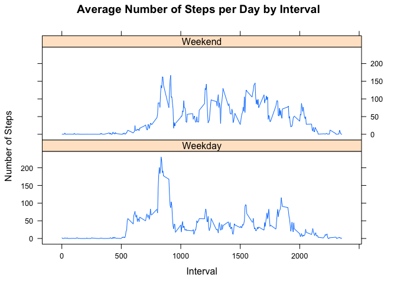

# Reproducible Research: Peer Assessment 1

## Loading and preprocessing the data

1. Load the data (i.e. read.csv())

```r
data <- read.csv(unz("activity.zip", "activity.csv"), header = T)
```

2. Process/transform the data (if necessary) into a format suitable for your analysis  
NA.

## What is mean total number of steps taken per day?

1. Ignore the missing values in the dataset.

```r
newdata <- na.omit(data)
```

2. Calculate the total number of steps taken per day

```r
dailysteps <- aggregate(steps ~ date, newdata, sum)
```

2. Make a histogram of the total number of steps taken each day

```r
hist(dailysteps$steps, 
     main = "Total Number of Steps Taken", 
     xlab="Number of Steps")
```

 

3. Calculate and report the mean and median of the total number of steps taken per day

```r
meansteps <- mean(dailysteps$steps)
mediansteps <- median(dailysteps$steps)
```
The mean number of steps taken per day is 1.0766189\times 10^{4}.  
The median number of steps taken per day is 10765.

## What is the average daily activity pattern?

1. Calculate average steps for each interval for all days. 

```r
intervalsteps <- aggregate(steps ~ interval, newdata, mean)
```

1. Make a time series plot (i.e. type = "l") of the 5-minute interval (x-axis) and the average number of steps taken, averaged across all days (y-axis)

```r
plot(intervalsteps$interval,
     intervalsteps$steps, 
     type="l", 
     xlab="Interval", 
     ylab="Number of Steps",
     main="Average Number of Steps by Interval")
```

 

2. Which 5-minute interval, on average across all the days in the dataset, contains the maximum number of steps?

```r
maxsteps <- intervalsteps[which.max(intervalsteps$steps), 1]
```
The 5-minute interval, on average across all the days in the dataset, which contains the maximum number of steps is 835.

## Imputing missing values

1. Calculate and report the total number of missing values in the dataset (i.e. the total number of rows with NAs)

```r
missing <- sum(!complete.cases(data))
```
There are 2304 missing values in the dataset.  

2. Devise a strategy for filling in all of the missing values in the dataset.   
The mean for the 5-minute interval will be used to replace the missing values.

3. Create a new dataset that is equal to the original dataset but with the missing data filled in.

```r
cleandata <- transform(data, steps = ifelse(is.na(data$steps), intervalsteps$steps[match(data$interval, intervalsteps$interval)], data$steps))
```

4. Make a histogram of the total number of steps taken each day 

```r
newdailysteps <- aggregate(steps ~ date, cleandata, sum)
hist(newdailysteps$steps, 
     main = "Total Number of Steps Taken", 
     xlab="Number of Steps")
```

 

5. Calculate and report the mean and median total number of steps taken per day. 

```r
newmeansteps <- mean(dailysteps$steps)
newmediansteps <- median(dailysteps$steps)
```
The mean number of steps taken per day is 1.0766189\times 10^{4}.  
The median number of steps taken per day is 10765.

6. Do these values differ from the estimates from the first part of the assignment?  
No, The difference is minimal.  

7. What is the impact of imputing missing data on the estimates of the total daily number of steps?  
The frequency increased due to the larger number of observations.

## Are there differences in activity patterns between weekdays and weekends?

1. Create a new factor variable in the dataset with two levels – “weekday” and “weekend” indicating whether a given date is a weekday or weekend day.

```r
weekdays <- c("Monday", "Tuesday", "Wednesday", "Thursday", 
              "Friday")
cleandata$day = as.factor(ifelse(is.element(weekdays(as.Date(cleandata$date)), weekdays), "Weekday", "Weekend"))
```

2. Make a panel plot containing a time series plot (i.e. type = "l") of the 5-minute interval (x-axis) and the average number of steps taken, averaged across all weekday days or weekend days (y-axis). 

```r
newintervalsteps <- aggregate(steps ~ interval + day, cleandata, mean)
library(lattice)
xyplot(newintervalsteps$steps ~ newintervalsteps$interval|newintervalsteps$day, 
       xlab="Interval", 
       ylab="Number of Steps",
       main="Average Number of Steps per Day by Interval",
       layout=c(1,2), 
       type="l")
```

 
